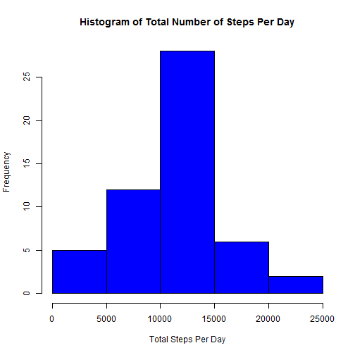
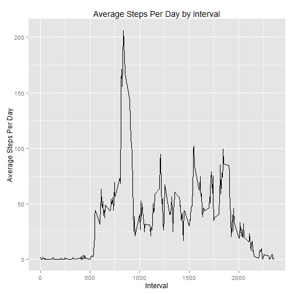
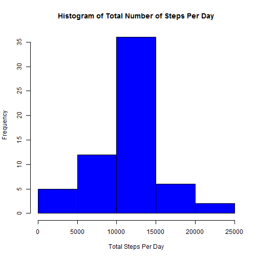
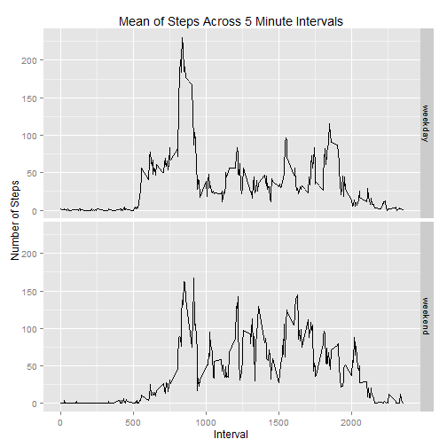

## Introduction

This analysis is the first project for "Reproducible Research" course. The
purpose of this analysis is to perform basic calculations on data from a personal
activity monitoring device. 

## Data

The data for this assignment can be downloaded from the course web site:

Dataset: [Activity monitoring data](https://d396qusza40orc.cloudfront.net/repdata%2Fdata%2Factivity.zip) [52K]

The variables included in this dataset are:

steps: Number of steps taking in a 5-minute interval (missing values are coded as NA)

date: The date on which the measurement was taken in YYYY-MM-DD format

interval: Identifier for the 5-minute interval in which measurement was taken

The dataset is stored in a comma-separated-value (CSV) file and there are a total of 17,568 observations in this dataset.

## Loading and Preprocessing the Data

In order to get started, R will check to see if the dataset already exists in the working directory. If it does, then the download will be skipped. Otherwise, the dataset will be downloaded, unzipped and the packages used in the analysis will be loaded. 


```r
#If necessary, set your working directory where you want the files saved, unzipped
#and written to. 
if(file.exists("activity.csv") == FALSE) {
    #Download data from source.
    download.file("https://d396qusza40orc.cloudfront.net/repdata%2Fdata%2Factivity.zip","files.zip")
}

#Unzip data into current working directory
data <- unzip("files.zip")

#Loads the dplyr, tidyr, ggplot2 and timeDate packages
library(tidyr)
library(dplyr)
```

```
## 
## Attaching package: 'dplyr'
## 
## The following objects are masked from 'package:stats':
## 
##     filter, lag
## 
## The following objects are masked from 'package:base':
## 
##     intersect, setdiff, setequal, union
```

```r
library(ggplot2)
library(timeDate)

#Read in the dataset as tbl_df format
activity <- tbl_df(read.csv("activity.csv"))
```

The activity object contains the "activity" dataset in a tbl_df format. 

# What is the mean total number of steps taken per day?

To answer this question initially, we will disregard any "NA" values. First, the
data will be grouped by date and the steps summed per day.This will be saved to the activity2 object. 


```r
#Calculate the total number of steps per day
activity2 <- activity %>% group_by(date) %>% summarise(sum(steps))
```

Next, the summarized steps by date will be represented in a histogram.


```r
#Create a histogram of total number of steps per day
hist(activity2$`sum(steps)`, xlab = "Total Steps Per Day", 
     main = "Histogram of Total Number of Steps Per Day", col = "Blue")
```

 

The mean will be calculated using the summarized dataset with no NA's


```r
#Calculate the mean and median of total steps per day without NA's
activitymean <- round(mean(activity2$`sum(steps)`,na.rm = TRUE),2)
options(scipen = 1, digits = 2)
```

The activity mean is 10766.19.

The median will be calculated next using the summarized dataset with no NA's.


```r
#Calculate the mean and median of total steps per day without NA's
activitymedian <- median(activity2$`sum(steps)`, na.rm = TRUE)
```

The activity median is 10765.

# What is the average daily pattern?

The first thing to do to view the average daily pattern will be to make a time phased line plot. This will be done using the ggplot2 package in R. However, before that can be done, we must calculate the average across interval. 


```r
#Calculate the average across the intervals across all days with NA's removed
activity3 <- activity %>% na.exclude(steps) %>% group_by(interval) %>% summarise(mean(steps))
```

Now, since the summarized average across intervals has been set to the activity3 object, the time phased plot can be generated. 


```r
#Create a time phased plot of the average across intervals
qplot(activity3$interval,activity3$`mean(steps)`, data = activity3, 
      geom = "line", xlab = "Interval", ylab = "Average Steps Per Day", 
      main = "Average Steps Per Day by Interval")
```

 

From the plot, it can be seen the max average occurs between intervals 500 and 1000, but it is hard to tell exactly which interval. However, R can report that max interval.


```r
#Print the max for time interval
maxinterval <- filter(activity3, activity3$`mean(steps)` == max(activity3$`mean(steps)`))
```

The max average of steps is 206.17 and the interval this occurs at is 835.

# Input Missing Values

Removing the NA's works for calculating the statistics for the dataset. However, what would the data look like with NA's filled in with the average of each interval?

Before replacing the NA's, the analysis will report how many NA's there are. This will be performed by creating a column of that reports if a value is NA with a Boolean value. Then the dataset will be filtered and counted using the count function. 


```r
#Count the number of NA's
activity4 <- mutate(activity,NAPresent = is.na(steps))
count1 <- activity4 %>% filter(NAPresent == TRUE) %>% count()
```

There are 2304 NA values in the activity dataset.

Now the logic can be written to replace the NA's with the average of the step interval calculated from the activity3 summarization object from the "Average Daily Pattern" section of this writing. This will be done with a loop. This loop will be cached to prevent constant recalculating. 


```r
#Loop through data frame and replace NA's with mean for the interval 
for(i in 1:length(activity4$steps)) {
    if(activity4[i,4] == TRUE) {
        #Filter to match the mean of the specific interval
        activity5 <- filter(activity3,interval == as.numeric(activity4[i,3]));
        #Replace NA vale with rounded mean value for the interval
        activity4[i,1] <- round(activity5[1,2],0)}}
#Create data frame that is copy of the original with NA values filled in
activity4 <- activity4[,1:3]
```

Before reviewing the replaced values dataset, here is a print of the first few lines of the original data set, which shows the NA values. 


```r
print(activity)
```

```
## Source: local data frame [17,568 x 3]
## 
##    steps       date interval
##    (int)     (fctr)    (int)
## 1     NA 2012-10-01        0
## 2     NA 2012-10-01        5
## 3     NA 2012-10-01       10
## 4     NA 2012-10-01       15
## 5     NA 2012-10-01       20
## 6     NA 2012-10-01       25
## 7     NA 2012-10-01       30
## 8     NA 2012-10-01       35
## 9     NA 2012-10-01       40
## 10    NA 2012-10-01       45
## ..   ...        ...      ...
```

A quick print functions shows the data frame with NA's values filled in. 


```r
print(activity4)
```

```
## Source: local data frame [17,568 x 3]
## 
##    steps       date interval
##    (dbl)     (fctr)    (int)
## 1      2 2012-10-01        0
## 2      0 2012-10-01        5
## 3      0 2012-10-01       10
## 4      0 2012-10-01       15
## 5      0 2012-10-01       20
## 6      2 2012-10-01       25
## 7      1 2012-10-01       30
## 8      1 2012-10-01       35
## 9      0 2012-10-01       40
## 10     1 2012-10-01       45
## ..   ...        ...      ...
```

Next, the total number of steps per day will be calculated from the new data frame with NA values built in. 


```r
#Calculate the total number of steps per day
activity5 <- activity4 %>% group_by(date) %>% summarise(sum(steps))
```

Next, the activity5 object can be used to make a histogram to display these results.


```r
#Create a histogram of total number of steps per day
hist(activity5$`sum(steps)`, xlab = "Total Steps Per Day", 
     main = "Histogram of Total Number of Steps Per Day", col = "Blue")
```

 

Next will be to calculate the mean steps per day without any NA's.


```r
#Calculate the mean of total steps per day without NA's
activity5mean <- mean(activity5$`sum(steps)`,na.rm = TRUE)
```

The activity mean without NA's is 10765.64.

Next will be to calculate the median steps per day without NA's.


```r
#Calculate the median of total steps per day without NA's
activity5median <- median(activity5$`sum(steps)`, na.rm = TRUE)
```

The activity median of steps without NA's is 10762.

The changes only differed the data slightly. Since the NA values were replaced with the averages per interval, this did not result in a drastic swing. The histograms are almost identical. 

The first mean without NA's is 10766.19 and the new mean with NA's replaced is 10765.64. This is a difference of 0.55.

Next, the first median without NA's is 10765 and the new median with NA's is 10762. This is a difference of 3. 

Based on the data results, we can say that replacing the NA's had minimal impact. An average difference of 0.55 is a minimal amount of steps to be concerned about. 

# Are there differences in activity patterns between weekdays and weekends?

The last part of this analysis will compare the patterns between weekdays and weekends. The first step will be to take the data frame with NA values filled in and detect if the date was a weekday or weekend. This will be performed using the IsWeekday function from the dateTime package. This will return a Boolean value. These boolean values will then be turned into named factors of weekday or weekend. 


```r
#Add weekday column to data frame with no NA's
activity4 <- activity4 %>% mutate("weekday" = isWeekday(activity4$date))
activity4$weekday <- factor(activity4$weekday, levels = c(TRUE,FALSE), labels = c("weekday","weekend"))
weekdaymean <- activity4 %>% group_by(weekday, interval) %>% summarise(mean(steps))
```

A quick print of the dataframe shows the new column:


```r
print(activity4)
```

```
## Source: local data frame [17,568 x 4]
## 
##    steps       date interval weekday
##    (dbl)     (fctr)    (int)  (fctr)
## 1      2 2012-10-01        0 weekday
## 2      0 2012-10-01        5 weekday
## 3      0 2012-10-01       10 weekday
## 4      0 2012-10-01       15 weekday
## 5      0 2012-10-01       20 weekday
## 6      2 2012-10-01       25 weekday
## 7      1 2012-10-01       30 weekday
## 8      1 2012-10-01       35 weekday
## 9      0 2012-10-01       40 weekday
## 10     1 2012-10-01       45 weekday
## ..   ...        ...      ...     ...
```

Next, a time phased line graph will be generated to compare the mean of steps between weekday and weekend levels.


```r
#Create the graph for weekday vs weekend interval
ggplot(weekdaymean, aes(weekdaymean$interval,weekdaymean$`mean(steps)`)) + geom_line() + 
    facet_grid(weekday~.) + ggtitle("Mean of Steps Across 5 Minute Intervals") + 
    labs(x = "Interval", y = "Number of Steps")
```

 

Overall, after reviewing the graphs, it appears that the weekend tends to have higher averages of steps. However, it does not have as large of a max as the weekdays do. This can lead to the conclusion that more walking is performed on the weekend on average and varies a little more than on weekdays.


```r
#Average the steps for weekdays and weekends.
weekdaymean2 <- activity4 %>% group_by(weekday) %>% summarise(mean(steps))
weekdaysd <- activity4 %>% group_by(weekday) %>% summarise(sd(steps))
```

The average number of steps on a weekday is 35.61 and the average number of steps on a weekend day is 42.36. This shows on average more steps are taken on a weekend day.

Next, the standard deviation on a weekday is 104.22 and the standard deviation on a weekend day is 108.23. This shows the average number of steps on a weekend day is slightly more variable than on a weekday. This makes sense since most of a weekday intervals are relatively close in values besides the max value. 

# Conclusion

Thanks to all for reading. Hopefully this reading was well structured and beneficial. 
